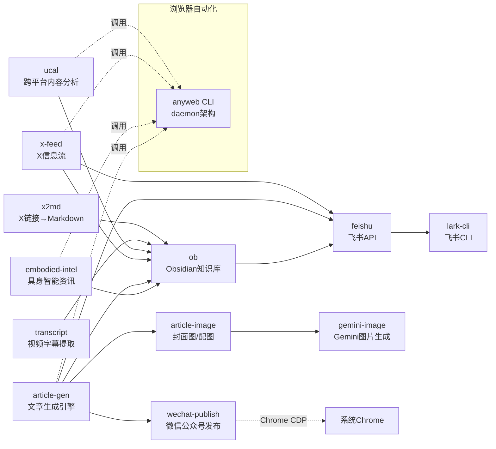
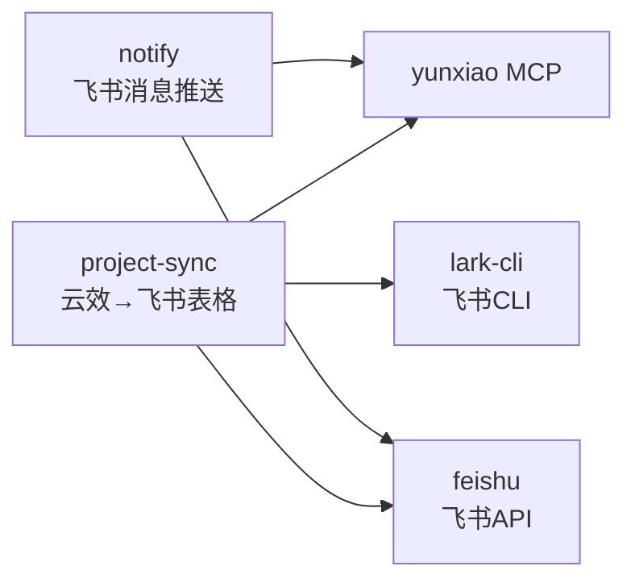
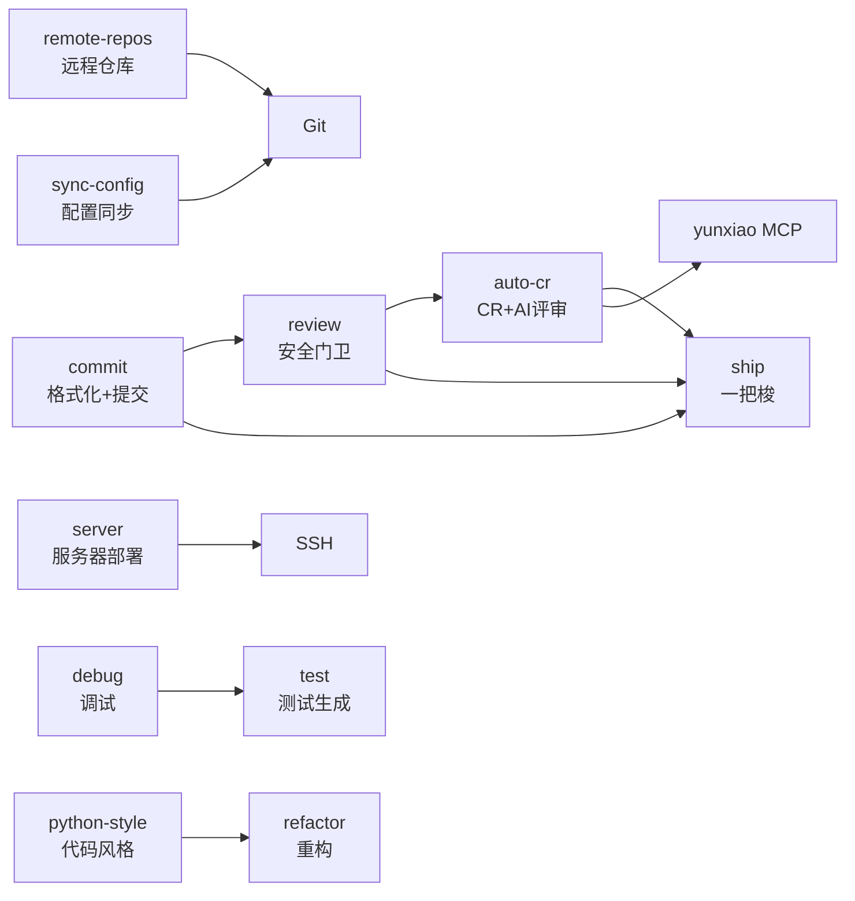
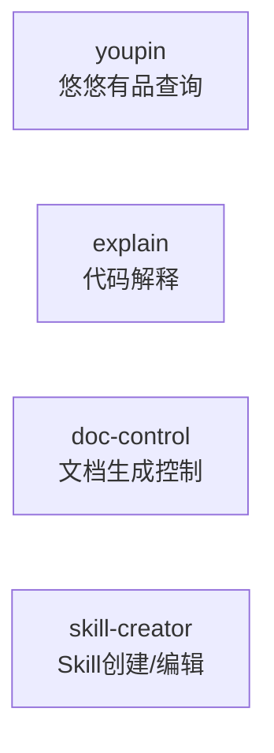

# Skill 架构全景

> 自动维护文档。每次 skill 发生重要变更时由 Claude 更新。
> 更新规则见 `~/.claude/CLAUDE.md` Section 9。

---

## 1. 工作流地图

### 1.1 内容创作与发布链路



### 1.2 项目管理与通知链路



### 1.3 开发工具链



### 1.4 独立工具



---

## 2. Skill 索引

| Skill | 用途 | 依赖 | 行数 | 关键能力 |
|-------|------|------|------|---------|
| **article-gen** | Operation-first 文章引擎 (13 type) | article-image, feishu, ob, x2md | 327 | create→repost→rewrite→translate→summarize→extract→update |
| **article-image** | 封面图/配图生成 | gemini-image | 196 | 5D风格系统 + Mermaid智能路由 |
| **commit** | Git提交消息生成 | - | 109 | Google convention风格 |
| **debug** | 系统性调试 | - | 219 | 症状分析→根因→方案 |
| **doc-control** | 文档生成控制 | - | 151 | 防止过度生成文档 |
| **embodied-intel** | 具身智能行业资讯 | anyweb CLI | 302 | 日报、人物追踪、人才流动 |
| **explain** | 代码解释 | - | 119 | 类比、图解、分步拆解 |
| **feishu** | 飞书API参考 | lark-cli | 948 | Wiki/Doc/Bitable/IM/Drive/Sheets 168工具 |
| **gemini-image** | Gemini图片生成 | - | 62 | 生成、编辑、理解 |
| **ob** | Obsidian知识库管理 | feishu | 520 | 写入/搜索/综合/洞察/飞书同步/待办 |
| **notify** | 飞书消息推送 | yunxiao-mcp, feishu | 242 | 按部门/人员定向私信推送 |
| **project-sync** | 云效→飞书表格同步 | yunxiao-mcp, feishu, lark-cli | 342 | 迭代工作项→多维表格 |
| **python-style** | Python代码风格 | - | 159 | PEP 8 / Google Style |
| **refactor** | 代码重构建议 | - | 138 | 可维护性、可读性、最佳实践 |
| **remote-repos** | 远程仓库操作 | - | 304 | GitHub(gh) + GitLab(glab) + 云效 |
| **review** | 代码审查（双模式：安全门卫+全量） | - | 96 | 安全门卫(pre-push) + 全量审查 |
| **auto-cr** | 云效 CR 自动创建+AI评审 | yunxiao-mcp | 120 | push→CR→compare→inline/global评论 |
| **ship** | 一把梭（commit→review→auto-cr） | commit, review, auto-cr | 80 | 全流程自动化 |
| **server** | 服务器管理 | - | 214 | SSH连接、部署、状态检查 |
| **skill-creator** | Skill创建/编辑 | - | 485 | 创建、修改、性能度量 |
| **sync-config** | 配置同步 | git | 127 | 备份/恢复/推送Claude配置 |
| **test** | 测试生成 | - | 216 | 单元测试 + 集成测试 |
| **ucal** | 跨平台内容分析 | anyweb CLI | 265 | 小红书/知乎/X/通用网页 |
| **x-feed** | X信息流系统(智涌日报) | anyweb CLI, feishu, ob | ~340+refs | Grok 4轮查询、视频标记、知识蒸馏 |
| **transcript** | 视频字幕提取+章节整理 | yt-dlp | 90 | YouTube/Bilibili→SRT+章节MD |
| **x2md** | X链接→Markdown | - | 100 | 帖子/Thread/长文转换 |
| **wechat-publish** | 微信公众号发布 | Chrome CDP | 165 | 图片上传→草稿创建→HTML转换→发布 |
| **youpin** | 悠悠有品查询 | - | 174 | 订单/库存/收益/市场行情(只读) |

**统计**: 26 个 skill, 6800+ 行

---

## 3. 关键工作流说明

### 3.1 ob 飞书发布流程 (Section 1.6)

```
判断新建/更新 → 预处理MD → curl上传导入 → moveDocsToWiki → Mermaid转图片(必须) → 回写frontmatter
```

- **新建**: feishu_node_token 为空 → 上传 → 导入 → 移入wiki
- **更新**: feishu_node_token 有值 → 删旧文档 → 重新导入 → 移入同一父节点
- **Mermaid**: 必须用 mmdc 渲染为 PNG → 定位飞书代码块 → 从后往前替换为图片
- **Token**: tenant_access_token 可完成全流程(含图片上传绑定)

### 3.2 内容采集链路

```
X链接 → x2md → Obsidian笔记
视频链接 → transcript (yt-dlp) → 章节字幕MD → Obsidian
X信息流 → x-feed (anyweb CLI) → Obsidian + 飞书
网页链接 → ucal (anyweb CLI) → 分析结果
行业资讯 → embodied-intel (anyweb CLI) → Obsidian + 飞书
```

### 3.3 日报媒体采集与发布链路 (x-feed Step 7.5 + 8)

```
日报生成 → 封面图(gemini-image + Pillow文字叠加) → 推文截图(anyweb + Pillow裁切)
    → 嵌入Obsidian(attachments/) → 飞书发布(_shared/feishu_publish.py)
    → 图片插入飞书文档(3-step: 创建空block → upload parent_node=block_id → PATCH replace_image)
    → 卡片广播(全员私信)
```

- **封面图**: gemini-image 生成无中文版本 → Pillow 叠加正确中文（STHeiti Medium.ttc）
- **推文截图**: anyweb 打开推文 → JS 隐藏非正文元素 → screenshot → Pillow 裁切到 article bounds
- **飞书图片**: `_insert_image_block()` helper 封装 3-step 方法，`insert_images_to_doc()` 批量插入并自动匹配推文位置
- **媒体目录**: `~/Downloads/x-daily/YYYY-MM-DD/`（cover.png + tweet-{id}.png）

### 3.4 浏览器自动化: ucal MCP → anyweb CLI

**2026-03-22 迁移完成**。所有 skill 从 `ucal_platform_read` / `ucal_browser_action` MCP 调用迁移到 `anyweb` CLI 原子命令。

| 维度 | ucal (旧) | anyweb (新) |
|------|----------|------------|
| 架构 | MCP server (FastMCP) | CLI + Unix socket daemon |
| 调用方式 | MCP tool call，单次批量 action | `anyweb open/read/eval/type` 逐条命令 |
| 页面状态 | 每次 `browser_action` 调用间重置 | daemon 在命令间保持页面状态 |
| 延迟 | ~3s（每次启动浏览器） | ~50ms（daemon 保持浏览器常驻） |
| 平台智能 | 内置 xhs/zhihu/x 适配器 | 同（复用适配器代码） |
| 反检测 | stealth + anti-detect | 同 |
| 会话管理 | 按平台隔离 context | 同 + URL 自动检测平台 |
| MCP 兼容 | 原生 | `anyweb --mcp` 兼容层 |

**受影响的 skill**: ucal, x-feed, embodied-intel, article-gen

**MCP 配置**: `~/.claude.json` 中 `ucal` server 已替换为 `anyweb`

**仓库**: GitHub `Mixiaomiupup/anyweb`, ucal 仓库保留作为历史归档

### 3.5 项目管理链路

```
云效迭代 → project-sync → 飞书多维表格 (数据同步)
云效迭代 → notify → 飞书私信卡片 (进展推送)
```

---

## 4. 变更日志

| 日期 | 涉及 Skill | 变更摘要 |
|------|-----------|---------|
| 2026-03-30 | x-feed | **重构**: Grok 查询从 3→4 轮（AI行业/AI从业者/具身行业/具身从业者），新增人事战略类新闻覆盖；SKILL.md 瘦身（716→~340行），媒体采集和飞书发布细节提取到 references/；新增视频 🎬 标记和具身视频优先下载策略；日期验证改为 `date` 命令确认；统一 5 板块分类；品牌名从"科技日报"改为"智涌日报" |
| 2026-03-23 | wechat-publish | **新增 skill**: 微信公众号发布流程(系统Chrome CDP + API)；涵盖图片上传、草稿创建、HTML转换、发布、修改已发表文章；关键约束：禁止 margin:-16px、必须用系统Chrome(非Playwright) |
| 2026-03-23 | x-feed, feishu, feishu_publish.py | **日报媒体链路**: x-feed 新增 Step 7.5(封面图+推文截图+Obsidian嵌入)；feishu_publish.py 重写 insert_images_to_doc() 使用 3-step 方法(_insert_image_block helper)，修复 block text 搜索范围(+bullet/ordered/callout)和 URL 解码匹配；feishu SKILL.md 更新 troubleshooting 和 helper 说明；ARCHITECTURE 新增 Section 3.3 媒体链路 |
| 2026-03-22 | ucal, x-feed, embodied-intel, article-gen | **ucal→anyweb 迁移**: 所有 skill 从 ucal MCP 调用迁移到 anyweb CLI 原子命令；MCP 配置从 ucal 切换到 anyweb；新增 Section 3.3 迁移对比表 |
| 2026-03-21 | ob, feishu | **飞书发布流程重构**: ob 新增 Section 1.6 完整发布链路(新建/更新判断 + 预处理 + 导入 + Mermaid转图片必须执行)；feishu 图片上传改为 tenant_token 优先(此前错误记录为必须UAT) |
| 2026-04-09 | article-gen | **Operation-first 重构**: 一级路由从 type 改为 operation（create/repost/rewrite/translate/summarize/extract/update），type 扩展到 13 种对齐 vault 实际数据，frontmatter.md 补充 article/tweet/digest/research 扩展字段 |
| 2026-04-09 | commit, review, auto-cr, ship | **AI Native 开发规范体系**: commit 加 pre-commit 格式化+scope+中文描述；review 改双模式（安全门卫+全量）；新增 auto-cr（云效 CR+AI 评审回填）和 ship（一把梭）；calibration CR #13 端到端验证通过 |
| 2026-03-21 | ARCHITECTURE.md | **初始创建**: 扫描全部 24 个 skill，建立架构全景、工作流地图、索引表 |
