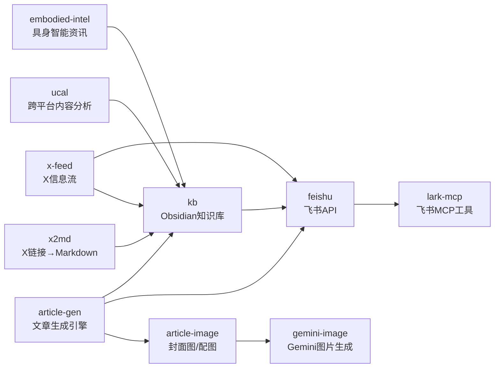
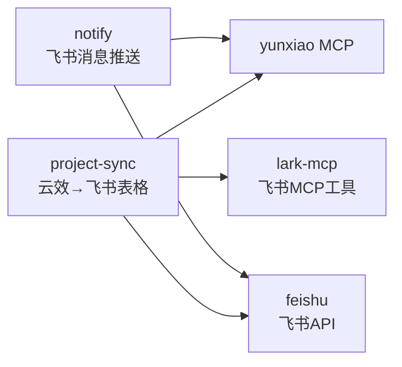
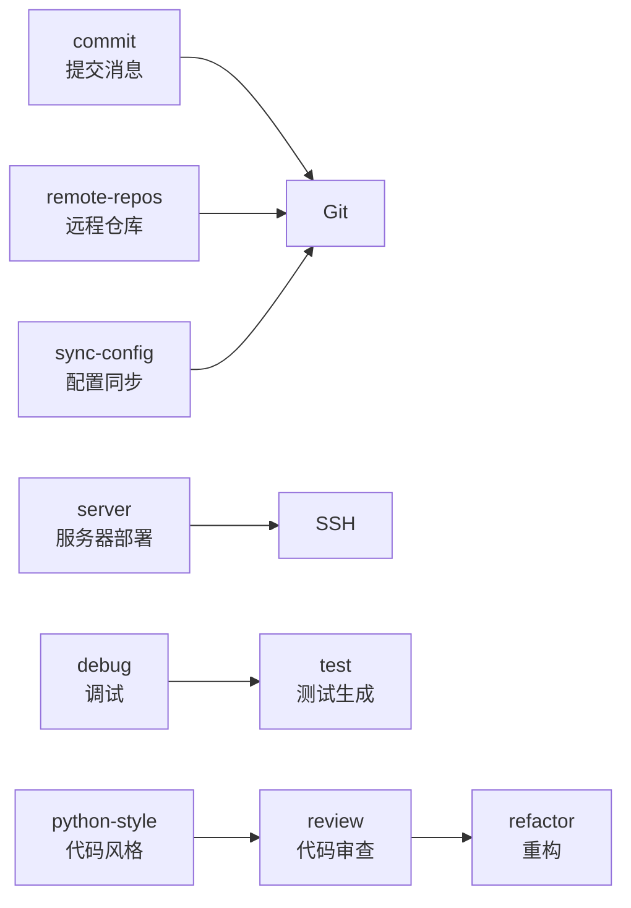
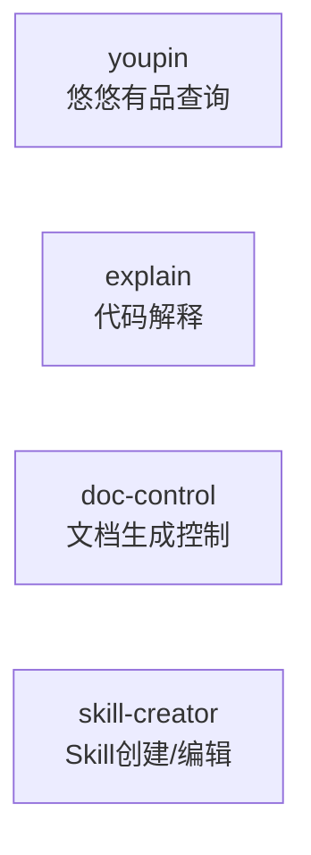

# Skill 架构全景

> 自动维护文档。每次 skill 发生重要变更时由 Claude 更新。
> 更新规则见 `~/.claude/CLAUDE.md` Section 9。

---

## 1. 工作流地图

### 1.1 内容创作与发布链路



### 1.2 项目管理与通知链路



### 1.3 开发工具链



### 1.4 独立工具



---

## 2. Skill 索引

| Skill | 用途 | 依赖 | 行数 | 关键能力 |
|-------|------|------|------|---------|
| **article-gen** | 6种文章类型生成引擎 | article-image, feishu, kb | 486 | convert→enrich→translate→cover→publish |
| **article-image** | 封面图/配图生成 | gemini-image | 196 | 5D风格系统 + Mermaid智能路由 |
| **commit** | Git提交消息生成 | - | 109 | Google convention风格 |
| **debug** | 系统性调试 | - | 219 | 症状分析→根因→方案 |
| **doc-control** | 文档生成控制 | - | 151 | 防止过度生成文档 |
| **embodied-intel** | 具身智能行业资讯 | - | 302 | 日报、人物追踪、人才流动 |
| **explain** | 代码解释 | - | 119 | 类比、图解、分步拆解 |
| **feishu** | 飞书API参考 | lark-mcp | 948 | Wiki/Doc/Bitable/IM/Drive/Sheets 168工具 |
| **gemini-image** | Gemini图片生成 | - | 62 | 生成、编辑、理解 |
| **kb** | Obsidian知识库管理 | feishu | 520 | 写入/搜索/综合/洞察/飞书同步/待办 |
| **notify** | 飞书消息推送 | yunxiao-mcp, feishu | 242 | 按部门/人员定向私信推送 |
| **project-sync** | 云效→飞书表格同步 | yunxiao-mcp, feishu, lark-mcp | 342 | 迭代工作项→多维表格 |
| **python-style** | Python代码风格 | - | 159 | PEP 8 / Google Style |
| **refactor** | 代码重构建议 | - | 138 | 可维护性、可读性、最佳实践 |
| **remote-repos** | 远程仓库操作 | - | 304 | GitHub(gh) + GitLab(glab) + 云效 |
| **review** | 代码审查 | - | 95 | 安全/Bug/性能/最佳实践 |
| **server** | 服务器管理 | - | 214 | SSH连接、部署、状态检查 |
| **skill-creator** | Skill创建/编辑 | - | 485 | 创建、修改、性能度量 |
| **sync-config** | 配置同步 | git | 127 | 备份/恢复/推送Claude配置 |
| **test** | 测试生成 | - | 216 | 单元测试 + 集成测试 |
| **ucal** | 跨平台内容分析 | ucal-mcp | 355 | 小红书/知乎/X/通用网页 |
| **x-feed** | X信息流系统 | feishu, kb | 437 | 关注扩展、热点提取、知识蒸馏 |
| **x2md** | X链接→Markdown | - | 100 | 帖子/Thread/长文转换 |
| **youpin** | 悠悠有品查询 | - | 174 | 订单/库存/收益/市场行情(只读) |

**统计**: 24 个 skill, 6500+ 行

---

## 3. 关键工作流说明

### 3.1 kb 飞书发布流程 (Section 1.6)

```
判断新建/更新 → 预处理MD → curl上传导入 → moveDocsToWiki → Mermaid转图片(必须) → 回写frontmatter
```

- **新建**: feishu_node_token 为空 → 上传 → 导入 → 移入wiki
- **更新**: feishu_node_token 有值 → 删旧文档 → 重新导入 → 移入同一父节点
- **Mermaid**: 必须用 mmdc 渲染为 PNG → 定位飞书代码块 → 从后往前替换为图片
- **Token**: tenant_access_token 可完成全流程(含图片上传绑定)

### 3.2 内容采集链路

```
X链接 → x2md → Obsidian笔记
X信息流 → x-feed → Obsidian + 飞书
网页链接 → ucal → 分析结果
行业资讯 → embodied-intel → Obsidian + 飞书
```

### 3.3 项目管理链路

```
云效迭代 → project-sync → 飞书多维表格 (数据同步)
云效迭代 → notify → 飞书私信卡片 (进展推送)
```

---

## 4. 变更日志

| 日期 | 涉及 Skill | 变更摘要 |
|------|-----------|---------|
| 2026-03-21 | kb, feishu | **飞书发布流程重构**: kb 新增 Section 1.6 完整发布链路(新建/更新判断 + 预处理 + 导入 + Mermaid转图片必须执行)；feishu 图片上传改为 tenant_token 优先(此前错误记录为必须UAT) |
| 2026-03-21 | ARCHITECTURE.md | **初始创建**: 扫描全部 24 个 skill，建立架构全景、工作流地图、索引表 |
