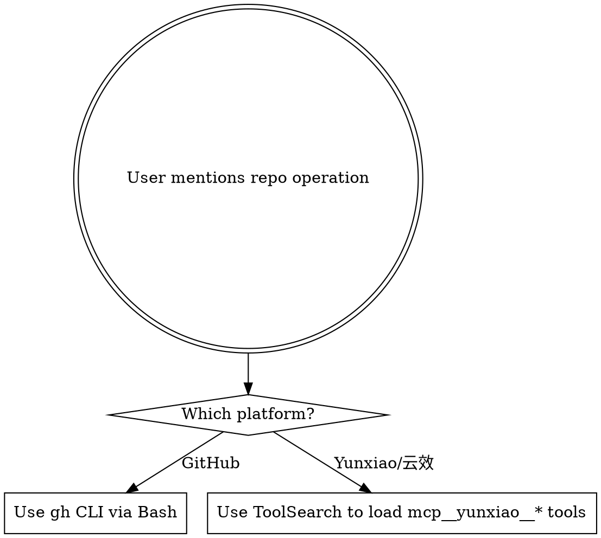

# Remote Repository Tools

Two remote repo backends available. Choose by platform:

| Platform | Tool | Auth | Trigger Keywords |
|----------|------|------|------------------|
| **GitHub** | `gh` CLI (Bash) | Already configured | github, gh, PR, issue |
| **云效 (Yunxiao)** | `mcp__yunxiao__*` (ToolSearch → MCP) | Already configured | 云效, yunxiao, 流水线, 变更请求 |

## Decision Flow



---

## GitHub (`gh` CLI)

Run via Bash tool. No extra setup needed.

### Quick Reference

| Operation | Command |
|-----------|---------|
| Clone | `gh repo clone owner/repo` |
| Create repo | `gh repo create name --public/--private` |
| List repos | `gh repo list [owner]` |
| View repo | `gh repo view [owner/repo]` |
| Create PR | `gh pr create --title "..." --body "..."` |
| List PRs | `gh pr list` |
| View PR | `gh pr view <number>` |
| Merge PR | `gh pr merge <number>` |
| PR comments | `gh api repos/{owner}/{repo}/pulls/{n}/comments` |
| Create issue | `gh issue create --title "..." --body "..."` |
| List issues | `gh issue list` |
| View issue | `gh issue view <number>` |
| Releases | `gh release list` / `gh release create` |
| Actions | `gh run list` / `gh run view <id>` |
| API call | `gh api <endpoint>` |

### Tips
- Use `gh pr create --body "$(cat <<'EOF' ... EOF)"` for multi-line bodies
- Use `gh api` for any REST/GraphQL endpoint not covered by subcommands
- Run `gh <command> --help` for full options

---

## 云效 Yunxiao (MCP Tools)

**CRITICAL:** Must load tools via `ToolSearch` before calling. Tools are deferred.

```
ToolSearch(query: "+yunxiao <keyword>")  →  then call the returned tool
```

### Tool Categories

#### Repository & Code

| Operation | Tool Name | Key Params |
|-----------|-----------|------------|
| Get repo | `get_repository` | repositoryIdentity |
| List repos | `list_repositories` | - |
| List branches | `list_branches` | repositoryIdentity |
| Create branch | `create_branch` | repositoryIdentity, branchName, ref |
| Delete branch | `delete_branch` | repositoryIdentity, branchName |
| List files | `list_files` | repositoryIdentity, branchName, path |
| Get file content | `get_file_blobs` | repositoryIdentity, filePath, ref |
| Create file | `create_file` | repositoryIdentity, branchName, filePath, content |
| Update file | `update_file` | repositoryIdentity, branchName, filePath, content |
| Delete file | `delete_file` | repositoryIdentity, branchName, filePath |
| Compare | `compare` | repositoryIdentity, from, to |
| List commits | `list_commits` | repositoryIdentity |
| Get commit | `get_commit` | repositoryIdentity, sha |
| Comment on commit | `create_commit_comment` | repositoryIdentity, sha |

#### Change Requests (MR/PR equivalent)

| Operation | Tool Name |
|-----------|-----------|
| List CRs | `list_change_requests` |
| Get CR | `get_change_request` |
| Create CR | `create_change_request` |
| List CR comments | `list_change_request_comments` |
| Add CR comment | `create_change_request_comment` |
| Update CR comment | `update_change_request_comment` |
| List patch sets | `list_change_request_patch_sets` |

#### Pipelines (CI/CD)

| Operation | Tool Name |
|-----------|-----------|
| List pipelines | `list_pipelines` |
| Get pipeline | `get_pipeline` |
| Create pipeline run | `create_pipeline_run` |
| Get latest run | `get_latest_pipeline_run` |
| Get run detail | `get_pipeline_run` |
| List runs | `list_pipeline_runs` |
| List jobs | `list_pipeline_jobs_by_category` |
| Get job log | `get_pipeline_job_run_log` |
| Generate YAML | `generate_pipeline_yaml` |
| Create from desc | `create_pipeline_from_description` |
| Smart list | `smart_list_pipelines` |
| Update pipeline | `update_pipeline` |

#### Work Items (Project Management)

| Operation | Tool Name |
|-----------|-----------|
| Search items | `search_workitems` |
| Get item | `get_work_item` |
| Create item | `create_work_item` |
| Update item | `update_work_item` |
| List types | `list_work_item_types` / `list_all_work_item_types` |
| Get workflow | `get_work_item_workflow` |
| Comments | `list_work_item_comments` / `create_work_item_comment` |

#### Sprints & Projects

| Operation | Tool Name |
|-----------|-----------|
| List sprints | `list_sprints` |
| Create sprint | `create_sprint` |
| Update sprint | `update_sprint` |
| Get project | `get_project` |
| Search projects | `search_projects` |

#### Applications & Deployment

| Operation | Tool Name |
|-----------|-----------|
| List apps | `list_applications` |
| Get app | `get_application` |
| Create app | `create_application` |
| Release workflows | `list_app_release_workflows` |
| Execute stage | `execute_app_release_stage` |
| Deploy order | `get_vm_deploy_order` |
| Deploy log | `get_vm_deploy_machine_log` |
| Change orders | `create_change_order` / `get_change_order` |

#### Testing

| Operation | Tool Name |
|-----------|-----------|
| Search testcases | `search_testcases` |
| Create testcase | `create_testcase` |
| Get testcase | `get_testcase` |
| List test plans | `list_test_plans` |
| Test results | `get_test_result_list` / `update_test_result` |

#### Organization & Members

| Operation | Tool Name |
|-----------|-----------|
| Current user | `get_current_user` |
| Current org | `get_current_organization_info` |
| List members | `list_organization_members` |
| Search members | `search_organization_members` |
| Departments | `list_organization_departments` |

#### Packages & Artifacts

| Operation | Tool Name |
|-----------|-----------|
| List package repos | `list_package_repositories` |
| List artifacts | `list_artifacts` |
| Get artifact | `get_artifact` |

#### Variables & Config

| Operation | Tool Name |
|-----------|-----------|
| Global vars | `create_global_var` / `get_global_var` / `list_global_vars` |
| Variable groups | `create_variable_group` / `get_variable_group` |
| Service connections | `list_service_connections` |

### Usage Pattern

```
# Step 1: Load the tool
ToolSearch(query: "+yunxiao list_change_requests")

# Step 2: Call it
mcp__yunxiao__list_change_requests(repositoryIdentity: "my-repo", ...)
```

All tool names are prefixed with `mcp__yunxiao__` when calling.

---

## Common Workflows

### Create a PR/CR

**GitHub:**
```bash
gh pr create --title "feat: add auth" --body "## Summary\n- Added JWT auth"
```

**Yunxiao:**
```
ToolSearch("+yunxiao create_change_request")
→ mcp__yunxiao__create_change_request(...)
```

### Check CI/CD Status

**GitHub:**
```bash
gh run list --limit 5
gh run view <run-id>
```

**Yunxiao:**
```
ToolSearch("+yunxiao pipeline_run")
→ mcp__yunxiao__get_latest_pipeline_run(pipelineId: "...")
→ mcp__yunxiao__get_pipeline_job_run_log(...)  # if need logs
```

### View Repo & Branches

**GitHub:**
```bash
gh repo view owner/repo
git branch -r
```

**Yunxiao:**
```
ToolSearch("+yunxiao repository")
→ mcp__yunxiao__get_repository(repositoryIdentity: "...")
→ mcp__yunxiao__list_branches(repositoryIdentity: "...")
```

## Common Mistakes

| Mistake | Fix |
|---------|-----|
| Calling `mcp__yunxiao__*` without ToolSearch first | Always load via `ToolSearch("+yunxiao ...")` first |
| Using `gh` for Yunxiao repos | Check which platform the repo is on |
| Forgetting `mcp__yunxiao__` prefix | All Yunxiao tools have this prefix when called |
| Using `gh api` for authenticated private content | Use `gh api` with proper endpoint paths |
