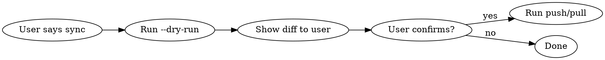

# Claude Config Sync (cc-sync)

Unified CLI for syncing Claude Code config and skills to remote repos.

## Architecture

| Component | Repos | Content |
|-----------|-------|---------|
| **config** | GitHub `claude-config` + Yunxiao `claude_config` | hooks, settings, agents, commands, output-styles, plans infra, plugins, docs |
| **skills** | GitHub `claude-skills` + Yunxiao `claude_skills` | 15 first-party skills (excluding baoyu-skills) |
| **third-party** | Each has own remote | baoyu-skills etc. (tracked in `component-manifest.json`) |

## Commands

### Push (local → remote)

| Action | Command |
|--------|---------|
| Push everything | `~/.claude/cc-sync push` |
| Push config only | `~/.claude/cc-sync push --target config` |
| Push skills only | `~/.claude/cc-sync push --target skills` |
| Push to GitHub only | `~/.claude/cc-sync push --platform github` |
| Push to Yunxiao only | `~/.claude/cc-sync push --platform yunxiao` |
| Preview changes | `~/.claude/cc-sync push --dry-run` |
| Skip confirmation | `~/.claude/cc-sync push --yes` |
| Custom commit msg | `~/.claude/cc-sync push -m "feat: add new skill"` |
| Combine options | `~/.claude/cc-sync push --target skills --platform github --dry-run` |

### Pull (remote → local)

| Action | Command |
|--------|---------|
| Pull everything | `~/.claude/cc-sync pull` |
| Pull config only | `~/.claude/cc-sync pull --target config` |
| Pull skills only | `~/.claude/cc-sync pull --target skills` |
| Pull from Yunxiao | `~/.claude/cc-sync pull --from yunxiao` |
| Preview restore | `~/.claude/cc-sync pull --dry-run` |

### Status

| Action | Command |
|--------|---------|
| Show sync status | `~/.claude/cc-sync status` |

## Workflow



### Push (daily use)

1. Run `~/.claude/cc-sync push --dry-run` first
2. Show the diff summary to user
3. If user confirms, run `~/.claude/cc-sync push`
4. Report commit hash and changed files

### Pull (new machine)

1. Bootstrap:
   ```bash
   git clone git@github.com:Mixiaomiupup/claude-config.git /tmp/cc
   cp /tmp/cc/{cc-sync,sync-config.sh,component-manifest.json} ~/.claude/
   chmod +x ~/.claude/cc-sync
   ```
2. Run `~/.claude/cc-sync pull --dry-run` first
3. Show what will be restored
4. If user confirms, run `~/.claude/cc-sync pull`
5. Remind user to set `ANTHROPIC_AUTH_TOKEN` if needed

## What Gets Synced

### Config repo (`claude-config`)

| Category | Items |
|----------|-------|
| Core config | `CLAUDE.md`, `AUTO_APPROVE_GUIDE.md`, `CONFIG_PACKAGE_GUIDE.md`, `settings.local.json` |
| Sanitized | `settings.json` (token → `YOUR_TOKEN_HERE`, `model` field stripped) |
| Directories | `hooks/`, `agents/`, `commands/`, `output-styles/` |
| Plans infra | `plans/README.md`, `plans/PLANS_INDEX.md`, `plans/templates/` |
| Plugins | `plugins/` (excluding cache) |
| Sync infra | `sync-config.sh`, `cc-sync`, `component-manifest.json` |

### Skills repo (`claude-skills`)

| Category | Items |
|----------|-------|
| First-party | 15 skills: commit, debug, doc-control, explain, gemini-image, kb, python-style, refactor, remote-repos, review, server, sync-config, test, ucal, x2md |
| Sanitized | `server/SKILL.md` (passwords/IPs → placeholders), `gemini-image/SKILL.md` (GCP credentials → placeholders) |
| Excluded | `baoyu-skills` (has own git repo, tracked in manifest) |

## Key Behaviors

- **Config and skills are separate repos**: config repo has no `skills/` directory
- **Dual platform push**: Both GitHub and Yunxiao receive the same content
- **Sanitization**: `settings.json` tokens and skill credentials (`server/SKILL.md`, `gemini-image/SKILL.md`) are replaced with placeholders
- **Lock file**: `/private/tmp/claude-config-sync.lock` prevents concurrent push runs
- **Restore merge**: On pull, local `ANTHROPIC_AUTH_TOKEN` is preserved if it exists
- **Third-party skills**: Tracked in `component-manifest.json`, auto-cloned on pull
- **Staging dirs**: `/private/tmp/claude-config-staging` and `/private/tmp/claude-skills-staging`

## Common Mistakes

| Mistake | Fix |
|---------|-----|
| Running push without `--dry-run` first | Always preview first |
| Forgetting to set token after pull on new machine | Check `settings.json` for `YOUR_TOKEN_HERE` |
| Expecting baoyu-skills in skills repo | It's excluded; check `component-manifest.json` |
| Running push while another is in progress | Wait for lock to release or remove stale lock |
| Using old scripts (sync-to-remote.sh etc.) | Use `cc-sync` instead — old scripts are deprecated |
