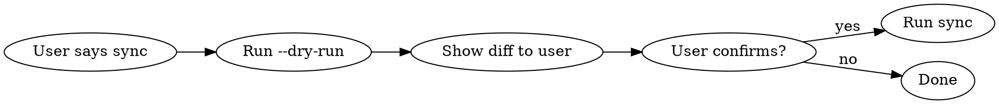

# Claude Config Sync

Single-command sync of `~/.claude/` to `git@github.com:Mixiaomiupup/claude-config.git`. Local is the authority source.

## Commands

| Action | Command |
|--------|---------|
| Preview changes | `~/.claude/sync-to-remote.sh --dry-run` |
| Sync to remote | `~/.claude/sync-to-remote.sh` |
| Sync with message | `~/.claude/sync-to-remote.sh -m "feat: add new skill"` |
| Preview restore | `~/.claude/restore-from-remote.sh --dry-run` |
| Full restore | `~/.claude/restore-from-remote.sh` |
| Selective restore | `~/.claude/restore-from-remote.sh --only skills hooks` |

## Workflow

### Sync (daily use)

1. Run `~/.claude/sync-to-remote.sh --dry-run` first
2. Show the diff summary to user
3. If user confirms, run `~/.claude/sync-to-remote.sh`
4. Report commit hash and changed files

### Restore (new machine)

1. Run `~/.claude/restore-from-remote.sh --dry-run` first
2. Show what will be restored
3. If user confirms, run `~/.claude/restore-from-remote.sh`
4. Remind user to set `ANTHROPIC_AUTH_TOKEN` if settings.json was restored without local merge

## What Gets Synced

| Category | Items |
|----------|-------|
| Core config | `CLAUDE.md`, `AUTO_APPROVE_GUIDE.md`, `CONFIG_PACKAGE_GUIDE.md`, `settings.local.json` |
| Sanitized | `settings.json` (token replaced with `YOUR_TOKEN_HERE`, `model` field stripped) |
| Directories | `hooks/`, `skills/` (excluding baoyu-skills), `agents/`, `commands/`, `output-styles/` |
| Plans infra | `plans/README.md`, `plans/PLANS_INDEX.md`, `plans/templates/` |
| Plugins | `plugins/installed_plugins.json` |
| Sync scripts | `sync-config.sh`, `sync-to-remote.sh`, `restore-from-remote.sh` |
| Auto-generated | `skill-sources.json` (third-party skill git URLs, detected from `skills/*/.git/`) |

## What Gets Excluded

- **baoyu-skills**: Has its own git repo, recorded in `skill-sources.json` instead
- **Runtime data**: `history.jsonl`, `stats-cache.json`, `auto-approve-audit.log`
- **Cache dirs**: `session-env/`, `shell-snapshots/`, `file-history/`, `debug/`, `todos/`, `telemetry/`, `usage-data/`, `statsig/`, `ide/`, `projects/`, `tasks/`
- **Plugin cache**: `plugins/cache/`, `plugins/marketplaces/`
- **Temp plans**: `plans/active/`, `plans/archive/`, individual plan `.md` files

## Key Behaviors

- **Sanitization**: `settings.json` is always sanitized before push. Never push raw tokens.
- **Lock file**: `/private/tmp/claude-config-sync.lock` prevents concurrent runs.
- **Restore merge**: On restore, local `ANTHROPIC_AUTH_TOKEN` is preserved if it exists and is not a placeholder.
- **Third-party skills**: Detected by scanning `skills/*/` for `.git/` directories. URLs are written to `skill-sources.json`. On restore, these are auto-cloned.
- **Staging dir**: `/private/tmp/claude-config-staging` is used as a temporary working copy.

## Common Mistakes

| Mistake | Fix |
|---------|-----|
| Running sync without `--dry-run` first | Always preview first |
| Forgetting to set token after restore on new machine | Check `settings.json` for `YOUR_TOKEN_HERE` |
| Expecting baoyu-skills to be in repo | It's excluded; check `skill-sources.json` for its URL |
| Running sync while another is in progress | Wait for lock to release or remove stale lock file |
